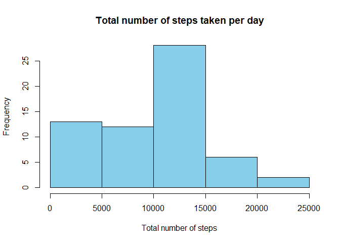
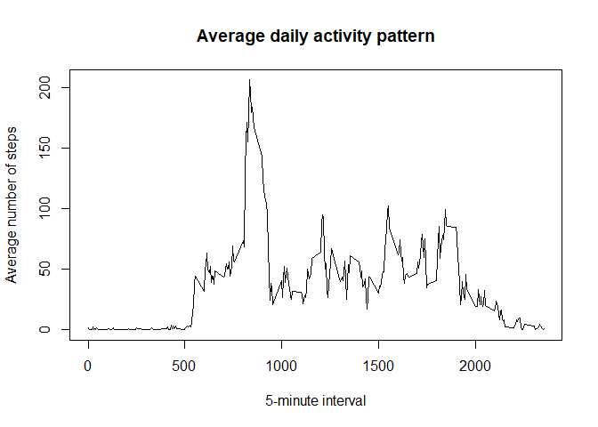
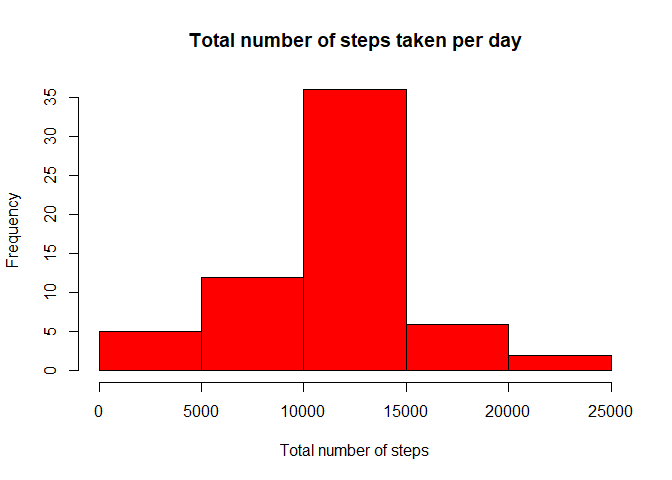
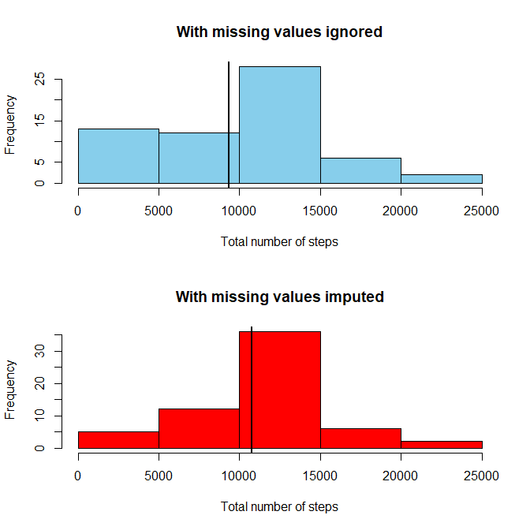
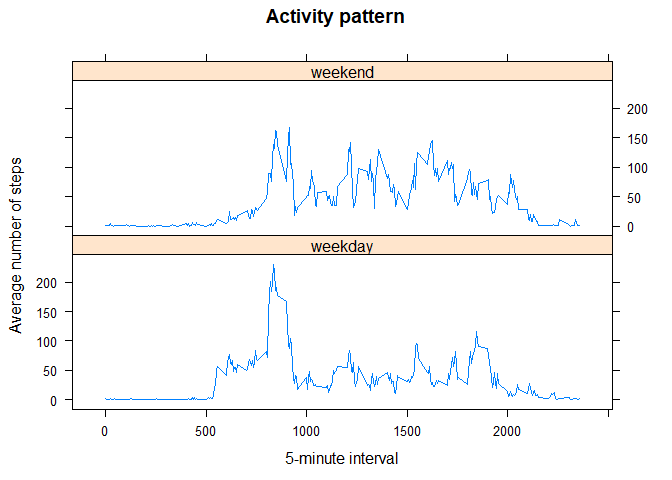

This assignment makes use of data from a personal activity monitoring device. This device collects data at 5 minute intervals throughout the day. The data consists of two months of data from an anonymous individual collected during the months of October and November, 2012 and include the number of steps taken in 5 minute intervals each day.


## Loading and preprocessing the data
Load the dataset and convert the date variable to Date class.

```r
unzip("activity.zip")
activity <- read.csv("activity.csv", header=TRUE, na.strings="NA", stringsAsFactors = FALSE)
activity$date <- as.Date(activity$date, "%Y-%m-%d")
```


## What is mean total number of steps taken per day?
Using the dplyr package, calculate the total number of steps taken per day, then make a histogram to illustrate this result with the base plotting system.

```r
library(dplyr)
```

```
## 
## Attaching package: 'dplyr'
```

```
## The following objects are masked from 'package:stats':
## 
##     filter, lag
```

```
## The following objects are masked from 'package:base':
## 
##     intersect, setdiff, setequal, union
```

```r
bydate <- activity %>% group_by(date) %>% summarize(total=sum(steps,na.rm=TRUE))
hist(bydate$total, xlab="Total number of steps", main="Total number of steps taken per day", col="skyblue")
```

<!-- -->

Calculate the mean of the total number of steps taken per day.

```r
mean(bydate$total)
```

```
## [1] 9354.23
```

Calculate the median of the total number of steps taken per day.

```r
median(bydate$total)
```

```
## [1] 10395
```


## What is the average daily activity pattern?
Calculate the average number of steps taken per 5-minute interval across all days, then make a time series plot to illustrate this result with the base plotting system.

```r
byinterval <- activity %>% group_by(interval) %>% summarize(average=mean(steps,na.rm=TRUE))
plot(byinterval$interval, byinterval$average, type="l", xlab="5-minute interval", ylab="Average number of steps", main="Average daily activity pattern")
```

<!-- -->

Identify which 5-minute interval, on average across all days, contains the maximum number of steps.

```r
maxAvg <- which.max(byinterval$average)
as.numeric(byinterval[maxAvg,1])
```

```
## [1] 835
```


## Imputing missing values
Calculate the total number of missing values in the dataset.

```r
sum(is.na(activity$steps))
```

```
## [1] 2304
```

Create a new dataset by replacing the missing steps values with the mean for the corresponding 5-minute interval.

```r
activity2 <- activity
missing <- is.na(activity2$steps)
for(i in 1:length(missing)){
        if(missing[i] == TRUE){
                minute <- activity2[i,3]
                new <- as.numeric(filter(byinterval, interval == minute)[,2])
                activity2[i,1] <- new
        }
}
```

Make a histogram of the total number of steps taken per day.

```r
bydate2 <- activity2 %>% group_by(date) %>% summarize(total=sum(steps))
hist(bydate2$total, xlab="Total number of steps", main="Total number of steps taken per day", col="red")
```

<!-- -->

Calculate the mean of the total number of steps taken per day.

```r
mean(bydate2$total)
```

```
## [1] 10766.19
```

Calculate the median of the total number of steps taken per day.

```r
median(bydate2$total)
```

```
## [1] 10766.19
```

Compare the total daily number of steps when missing values are ignored versus when missing values are imputed.

```r
par(mfrow=c(2,1))
hist(bydate$total, xlab="Total number of steps", main="With missing values ignored", col="skyblue")
abline(v=mean(bydate$total), lwd=2)
hist(bydate2$total, xlab="Total number of steps", main="With missing values imputed", col="red")
abline(v=mean(bydate2$total), lwd=2)
```

<!-- -->


## Are there differences in activity patterns between weekdays and weekends?
First create a new variable indicating the day of the week, then change the day of the week to "weekend" or "weekday" and make it a factor variable.

```r
activity2 <- mutate(activity2, day= weekdays(date))
activity2$day <- gsub("Saturday","weekend", activity2$day)
activity2$day <- gsub("Sunday","weekend", activity2$day)
activity2$day <- gsub("Monday","weekday", activity2$day)
activity2$day <- gsub("Tuesday","weekday", activity2$day)
activity2$day <- gsub("Wednesday","weekday", activity2$day)
activity2$day <- gsub("Thursday","weekday", activity2$day)
activity2$day <- gsub("Friday","weekday", activity2$day)
activity2 <- mutate(activity2, day= factor(day))
```

Calculate the average number of steps taken per 5-minute interval across weekdays or weekends, then make a panel time series plot to illustrate this result with the lattice plotting system.

```r
byinterval2 <- activity2 %>% group_by(day, interval) %>% summarize(average=mean(steps))
library(lattice)
xyplot(average ~ interval | day, byinterval2, type="l", layout=c(1,2), xlab="5-minute interval", ylab="Average number of steps", main="Activity pattern")
```

<!-- -->

